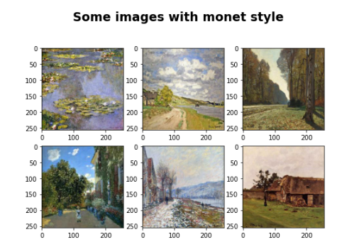
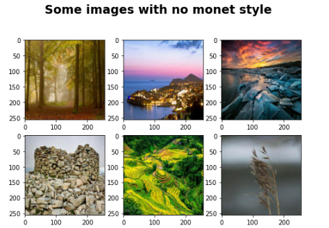
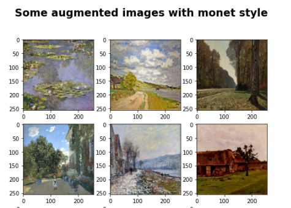
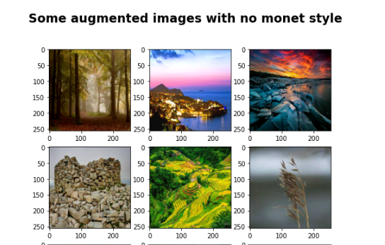
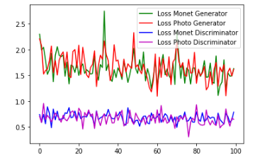
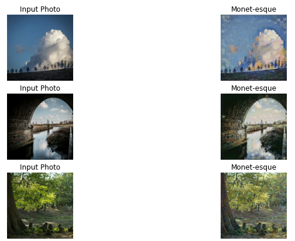

# DS-Project-7-Generating_Monet-esque_Images_CycleGAN
Designed a model that implements the CycleGAN architecture to convert pictures to a Monet style. Basically, the model adds the Monet style to any picture. 

* Built an image generator model that produces Monet'esque images. The model uses the CycleGAN algorithm to generate any image with a touch of Monet's skills.
* Dataset - Part of a Kaggle Competition. The dataset contains 300 Monet paintings and 7028 test photos on which we will apply the Monet effect.
* Model - The major aim in this project is to convert the test photos to have the Monet effect.  
## Code and Resources Used ##
**Python Version:** 3.10.5  
**Packages:**  numpy, pandas, matplotlib, PIL, tensorflow, keras, re, os, kaggle_datasets  
**For Web Framework Requirements:** _pip install -r requirements.txt_  
**Data Resources:** <https://www.kaggle.com/competitions/gan-getting-started>  

## About the Dataset ##
Computer vision has advanced tremendously in recent years and GANs(Generative Adversarial Networks)  are now capable of mimicking objects in a very convincing way. 
The **challenge** is to create museum worthy art from deep learning algorithms.  

The dataset contains 300 Monet paintings and 7028 test photos in the jpeg and TFRecord format. 
TFRecord is a simple format for storing a sequence of binary records.This is more efficient and saves a lot of space especialy when the dataset is large and complex.

## Data Augmentation ## 
It is a technique to increase the diversity of the training set by applying random (but realistic) transformations, such as image rotation, and it can be done very easily using the API tf.image.  
To learn more about it check out the official decantation: <https://www.tensorflow.org/tutorials/images/data_augmentation>.  

[Note:You can make changes here according to your preferences as long as it is realistic.]

## Data Preprocessing ##
Decoding the JPEG-encoded images to a uint8 tensor, casting it to a float32, dividing it by 127.5 and subtracting it by 1.  
All this is done to make the values in the tensor between -1 and 1.  

Defining a function that loads the datasets from the monet_files and photo_files, applies the augmentation to the data with the function that we defined earlier , then combines the consecutive elements of this dataset into batches. 
This function also uses prefetch, this allows later elements to be prepared while the current element is being processed. This improves the latency and throughput, at the cost of using additional memory to store prefetched elements.  
Finally, we create our final Dataset by zipping together the given datasets.

## Model Building ##
#### Simple Definition of CycleGAN #### 
It is an algorithm that transforms unpaired images to images across different domains where the dataset doesn't contain the images in one domain and their corresponding images in another domain (unsupervised learning).  
For example you can take an image of a horse and convert it to zebra, or take an image of summer and convert it into winter or any season you want.  

Instead of a standard GAN setup , we have two  discriminators and generators.  
**The generator G** : Take an image without any style and try to convert it into style of Monet image. 
**The generator F** : Take a style of Monet image and try to convert it into an image with no style. 
**The discriminator Dy**: Try to say if an image of style of Monet image is 'Real' or 'Fake' 
**The discriminator Dx**: Try to say if an normal image with no style is 'Real' or 'Fake' 

### Model Architecture ###

The generator has four sections :
- An Encoder that takes image as input and has three convolution layers all with a stride of two.
- A Transformer wich is a series of six residual blocks
- A Decoder which uses two transpose convolutions to enlarge the representation size
- One output layer to produce the final image in RGB

The discriminator is pretty simple, 
- It has four convolution layers all with a stride of two
- The output is a patchGAN, because we're not going to output a single scaler between 0 and 1, but what we are going to output is a grid of values, each of those values are going to be between 0 and 1.  
It is called a patchGan because each of those values corresponds to seeing a patch in the original image.(similar to filters in CNNs)

The architecture consists of **4 different kinds of loss functions** which are as follows:
1. The loss function for the discriminator that compares the original images to the grid of 1, and the false ones to the grid of 0. The ideal discriminator will output only the grid of 1 for the real image and the grid of zeros for the false.
2. The loss function for the generator that tries to trick the discriminator into generating an image so that the discriminator considers it as the real image. An ideal generator will cause the discriminator on the output to return a grid filled with 1.
3. The Cycle consistency loss, wich is the arithmetic mean of the differences between the original photo and the transformed fake photo. The lower the loss the better the higher the reconstruction quality.
4. The Identity loss, this is used to compare the image x and that image generator F that produces the images. We expect F (x) ~ x, i.e. if the Monet style image generator is a Monet image, the output should be the same image.

**Other Compiler Settings:**
1. As for the Initializer,  the weights are randomly initialized from a Gaussian distribution N (0, 0.02).
2. As for the optimizers , we use the 'adam' optimizer as it is efficient for large datasets and uses the gradient descent algorithm.

Finally we build the architecture by creating a Class which consists of both the generators and discriminators along with all the required settings. It returns us the total loss from the generators and the discriminator loss.

## Model Performance ##
Due to my poor computational power , I have set my number of Epochs to just 20. This obviously has given us a very bad result. I advise you to set the number of epochs to atleast a minimum of 100 to get optimal results.  

[Note:Higher the Epochs,Better the results]

The Ideal results should be when the discriminator losses are close to 0.5 (i.e when it fails to identify between a real or fake image) and the generator losses should be as low as possible.
I have found a visualization of all the loss function on kaggle.

#### Results ####
This is a small example of how the images look after it is converted with Monet's artistic touch :)

**If you are sad about your Artistic skills , GANs have got your back.**
