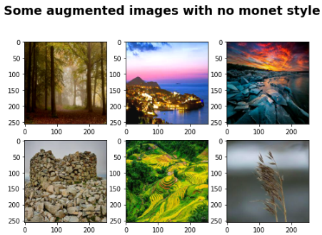

# DS-Project-7-Generating_Monet-esque_Images_CycleGAN
Designed a model that implements the CycleGAN architecture to convert pictures to a Monet style. Basically, the model adds the Monet style to any picture. 

* Built an image generator model that produces Monet'esque images. The model uses the CycleGAN algorithm to generate any image with a touch of Monet's skills.
* Dataset - Part of a Kaggle Competition. The dataset contains 300 Monet paintings and 7028 test photos on which we will apply the Monet effect.
* Model - The major aim in this project is to convert the test photos to have the Monet effect.  
## Code and Resources Used ##
**Python Version:** 3.10.5  
**Packages:**  numpy, pandas, matplotlib, PIL, tensorflow, keras, re, os, kaggle_datasets  
**For Web Framework Requirements:** _pip install -r requirements.txt_  
**Data Resources:** <https://www.kaggle.com/competitions/gan-getting-started>  

## About the Dataset ##
Computer vision has advanced tremendously in recent years and GANs(Generative Adversarial Networks)  are now capable of mimicking objects in a very convincing way. 
The **challenge** is to create museum worthy art from deep learning algorithms.  

The dataset contains 300 Monet paintings and 7028 test photos in the jpeg and TFRecord format. 
TFRecord is a simple format for storing a sequence of binary records.This is more efficient and saves a lot of space.

## Data Augmentation ## 
It is a technique to increase the diversity of the training set by applying random (but realistic) transformations, such as image rotation, and it can be done very easily using the API tf.image.  
To learn more about it check out the official decantation: <https://www.tensorflow.org/tutorials/images/data_augmentation>.  

[Note:You can make changes here according to your preferences as long as it is realistic.]

## Model Building ##
1. Uploading the mobilenet model from the url given above from the tensorflow-hub library 
2. Defining a simple keras Sequential model with the mobilenet model weights and an output layer.
3. Compiling the model accordingly:
    - optimizer : 'adam' - optimization technique for gradient descent
    - loss : 'SparseCategoricalCrossentropy' - as we are dealing with binary classification
    - metrics : 'accuracy' - simple as its just a binary classification

## Model Performance ##
As its a pre=trained model, we dont require a lot of epochs to train our model. After just 5 epochs we get an accuracy score of *0.99* and a loss score of *0.036* on the training data.
After Evaluating it on the test data, we receive an accuracy score of *0.97* and a loss score of *0.066*. That means we predict 97 pictures out of 100 accurately.
